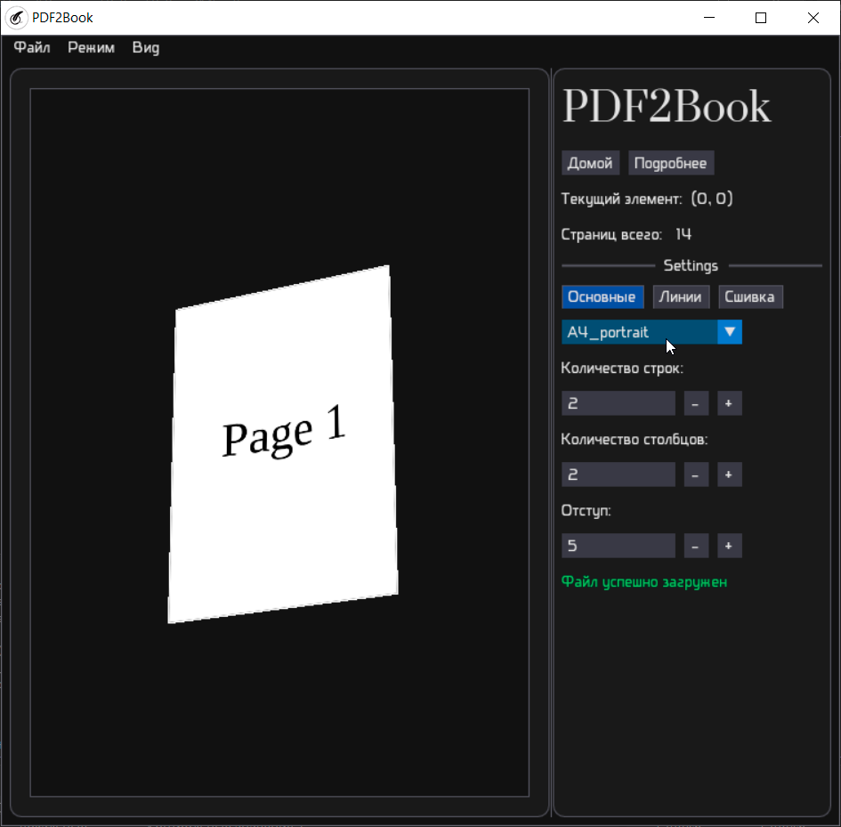
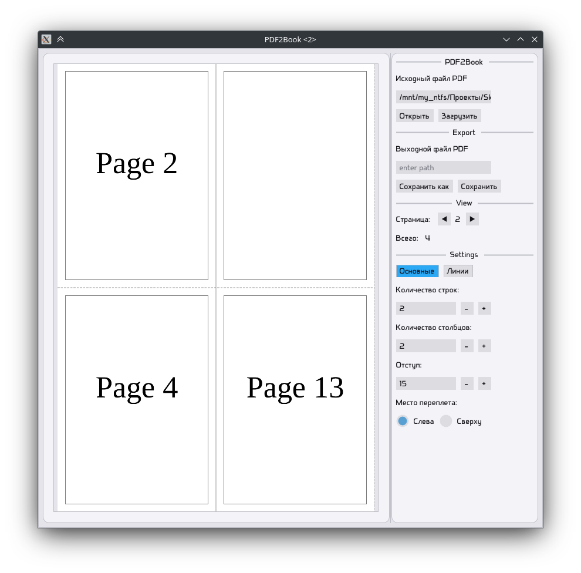
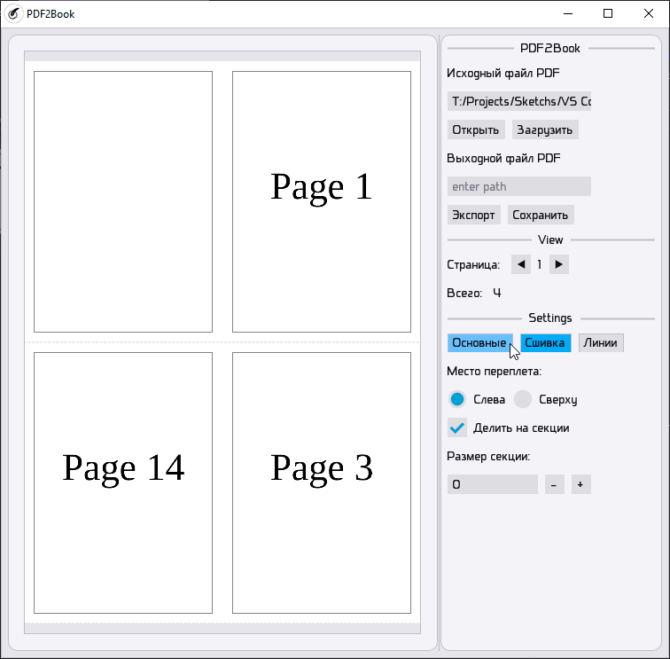
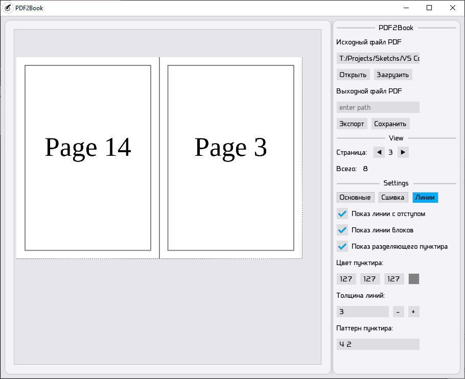

# PDF2Book

Программа, позволяющая распределять страницы PDF в таком порядке, чтобы при распечатке можно было сложить книжку из блоков по 2 страницы исходного документа

<p align="center">
  
</p>

<details>
<summary>Другие снимки</summary>
<p>

<p align="center">
  <br>
  <sub><b>Старая версия</b> <a href="https://github.com/t1rin/PDF2Book/releases/tag/v1.0">без меню</a></sub>
</p>
<table align="center">
<tr>
<td align="center" width="33%"><br><sub>Настройка линий (темный режим)</sub></td>
<td align="center" width="33%"><br><sub>Настройка сшивки (светлый режим)</sub></td>
<td align="center" width="33%"><br><sub>Настройка линий (светлый режим)</sub></td>
</tr>
</table>

</details>
</p>

---

## Оглавление
 
- [Описание](#description)
  - [Модуль `core`](#core-module)
  - [Модуль `ui`](#ui-module)
    - [Режим `Просмотр`](#preview-mode)
    - [Режим `Визуализация`](#visualization-mode)
- [Подключение](#сonnecting)
- [Примеры](#examples)

---

# Описание

- `core` - модуль реализации логики программы

- `ui` - модуль реализации пользовательского интерфейса

---

## Модуль `core`

отвечает за основную логику программы (класс `PDFImposer()`)

<details>
<summary>Методы класса</summary>
<p>

### `PDFImposer().load_doc(path)`

загружает исходный файл PDF

### `PDFImposer().update_params(rows=2, cols=2, side=Side.LEFT, margin=15, page_size=(841, 1189), show_cut_lines=True, show_margin_lines=True, show_blocks_lines=False, thickness_lines=1, color_lines=(0.5, 0.5, 0.5), dashes_pattern="4 2", quantity_pages_for_part=0)`

обновляет параметры расшивки

### `PDFImposer().get_preview(page_num, dpi=1, indexation_size=None)`

позволяет получить набор данных страницы `page_num` итогового документа без экспорта, если указан `indexation_size`, то будет проводится индексация страниц

### `PDFImposer().get_formatted_source_page(page_num, dpi=1)`

позволяет получить страницу номера `page_num` исходного документа

### `PDFImposer().update_doc()`

пересчитывает выходной документ по параметрам

### `PDFImposer().export_doc(path)`

сохраняет выходной файл

### `PDFImposer().get_preview_async(page_num, dpi=1, indexation=False, callback=None)`

то же, что и `PDFImposer().get_preview(...)`, но асинхронно, переданая функция `callback` будет вызвана по окончанию как: `callback(status, message)`, где `status = True`, если ошибок не было, иначе `status = False` и `message` - пояснение ошибки

### `PDFImposer().wait_for_completion(timeout=None)`

ожидает завершения текущей асинхронной задачи, если `timeout` задан, выйдет из функции по окончанию времени

### `PDFImposer().is_processing()`

проверяет, выполняется ли асинхронная задача

</p>
</details>

---

## Модуль `ui`

позволяет взаимодействовать с `PDFImposer()` посредствам пользовательского интерфейса

UI написан на библиотеке `dearpygui`

В программе реализованы 2 режима:

---

### Режим `Просмотр`

позволяет увидеть страницу перед сохранением в PDF и дальнейшей печатью

переключение через меню или клавишу F1

---

### Режим `Визуализация`

показывает итоговый вид будущей книги

переключение через меню или клавишу F2

---

Также имеются обработчики элементов интерфейса и комбинаций клавиш. Поддерживается динамическое сохранение параметров интерфейса — тем и шрифтов; их можно переключать по нажатию F3 и F4 соответственно

---

# Подключение

## 1. Создание виртуального окружения внутри каталога проекта

```shell
python3 -m venv venv
```

## 2. Подключение к виртуальному окружению

### Linux

```shell
source ./venv/bin/activate
```

или

### Windows

```shell
venv\Scripts\activate
```

## 3. Установка зависимостей

```shell
pip install -r requirements.txt
```

для Windows дополнительно:

```shell
pip install pywin32==312
```

---

# Примеры

получение документа для печати и сборки книжки:

```python
from core import PDFImposer


pi = PDFImposer()
pi.update_params(margin=0, rows=4)
pi.load_doc("input.pdf")
pi.export_doc("output.pdf")
```

работа на фоне и проверка статуса:

```python
import time

from core import PDFImposer, TOP


pi = PDFImposer()
pi.update_params(side=TOP, rows=2, cols=1)
pi.load_doc("input.pdf")

start = time.time()
while pi.is_processing():
    print("Обработка...")
    time.sleep(0.1)
end = time.time()

print(f"Документ готов! [{round(end-start, 3)}c]")

pi.export_doc("output.pdf")
```
